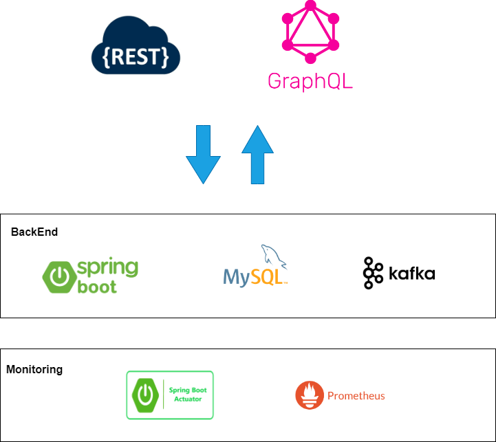

# documents-app-deploy
Project for deploying the complete documents app. This project uses the following stack.

## Installl

# start-containers
docker-compose up -d

# stop and delete containers and volumes
docker-compose down -v

#credentials to log in mysql
mysql -u root -pdocuments123 -h localhost documents_db 

# url for graphql
http://localhost:8080/graphiql?path=/graphql

# kafka ui
http://localhost:8088/

## Prometheus
http://localhost:9090/graph

