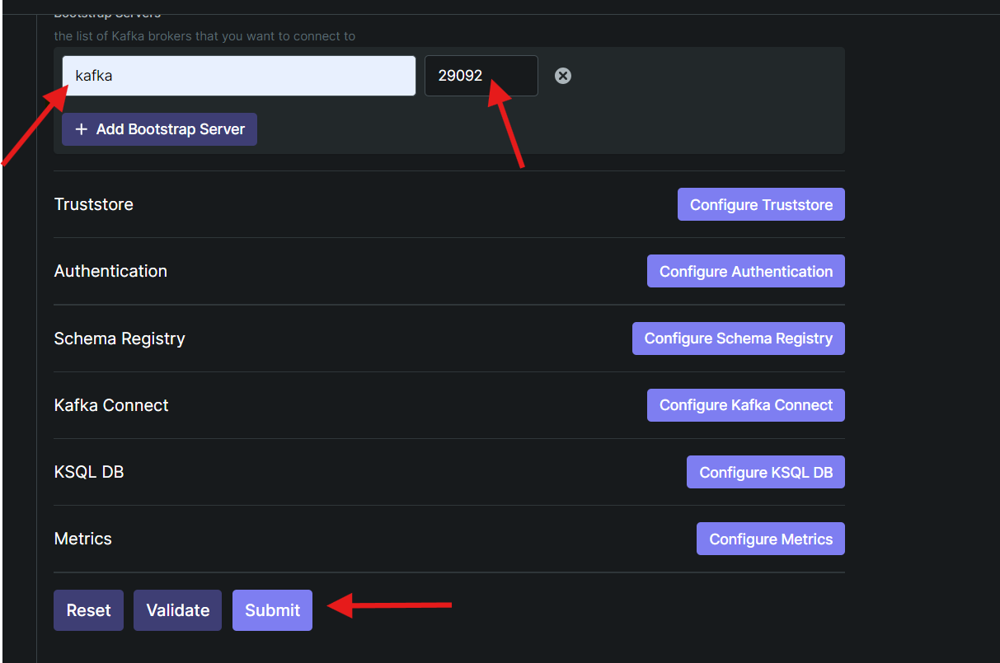

# documents-app-deploy
Project for deploying the complete documents app. This project uses the following stack.


## Install

Intall [Docker](https://docs.docker.com/get-docker/) depending of your operating system


Instalar [Docker Compose](https://docs.docker.com/compose/install/) depending of your operating system

If you use docker desktop, docker compose is already included

## start-containers
```bash
docker-compose up -d
```

This command will deploy every container used by de application

## stop and delete containers and volumes
```bash
docker-compose down -v
```

Use this command to stop and delete all containers and volumes

# kafka ui
This project includes a web interface to manage the kafka cluster. To use it go to http://localhost:8088/
There you must enter the following data and then click the Submit button.




# url for graphql
http://localhost:8080/graphiql?path=/graphql


## Prometheus
http://localhost:9090/graph

